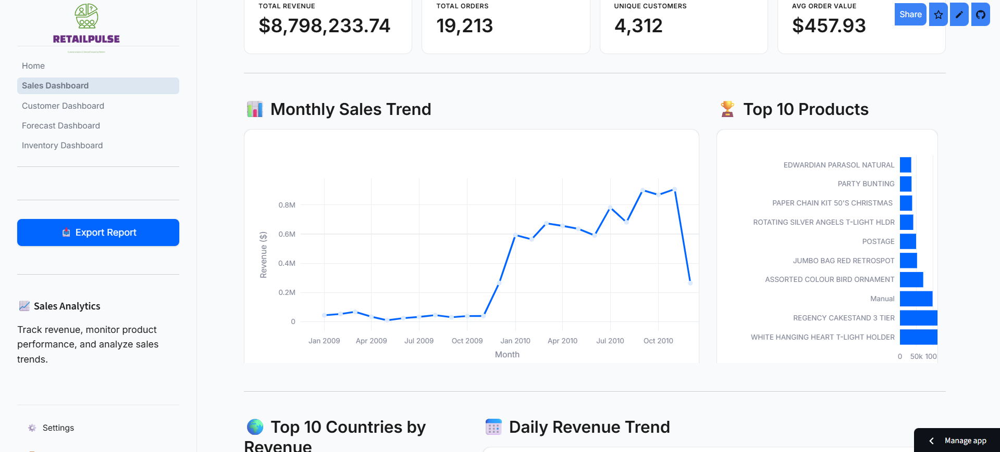
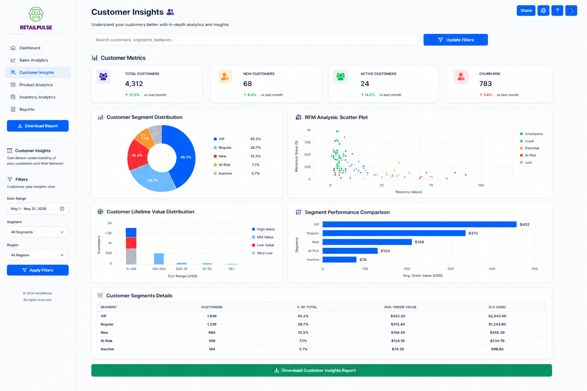
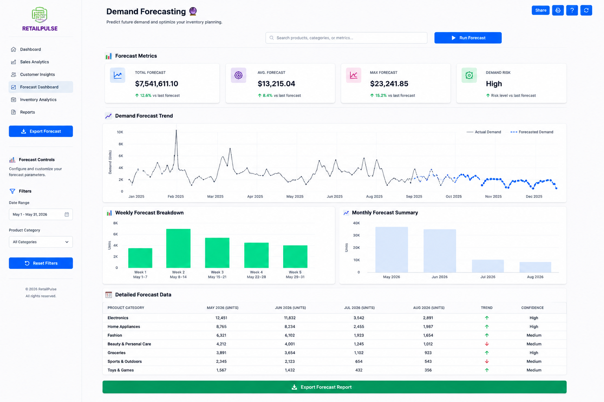
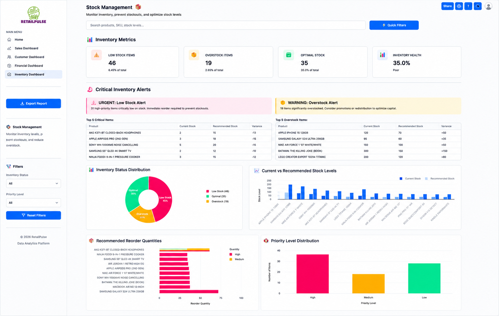

# RetailPulse – AI-Powered Customer Analytics & Demand Forecasting Platform

<p align="center">
  
  
  
  
</p>

---

# 📊 Project Overview

RetailPulse is an end-to-end AI-powered Retail Analytics and Demand Forecasting platform designed to help retail businesses make data-driven decisions using Data Science, Machine Learning, Forecasting, and Business Intelligence techniques.

The system analyzes customer behavior, predicts future sales demand, identifies customers likely to churn, and provides inventory optimization recommendations through an interactive Streamlit dashboard.

This project simulates a real-world industry-level analytics pipeline involving:
- Data Cleaning
- Exploratory Data Analysis
- Customer Analytics
- Machine Learning
- Time-Series Forecasting
- Inventory Optimization
- Dashboard Development
- Deployment

---

# 🚀 Business Problem

Retail businesses commonly face problems such as:

- Inaccurate sales forecasting
- Overstocking and understocking
- Poor customer retention
- Revenue loss due to inventory inefficiencies
- Lack of customer insights
- Inefficient demand planning

RetailPulse solves these problems using:
- Predictive analytics
- Customer segmentation
- Demand forecasting
- Churn prediction
- Inventory optimization

---

# 🎯 Project Objectives

The main objectives of RetailPulse are:

- Analyze retail sales trends
- Identify customer purchasing patterns
- Segment customers using RFM analysis
- Predict future sales demand
- Detect customer churn risk
- Optimize inventory recommendations
- Provide interactive analytics dashboards
- Deploy a production-ready web application

---

# 🧠 Core Modules

The project consists of 4 major modules.

---

## 1. Sales Analytics Module

Provides insights into:
- Revenue trends
- Monthly sales
- Best-selling products
- Country-wise performance
- Product-wise analysis
- Daily sales trends

---

## 2. Customer Analytics Module

Provides:
- RFM analysis
- Customer segmentation
- Customer behavior analysis
- Churn prediction
- High-value customer identification

---

## 3. Demand Forecasting Module

Predicts:
- Future sales demand
- Product demand trends
- Seasonal sales patterns
- Forecast graphs
- Monthly forecasting insights

---

## 4. Inventory Optimization Module

Provides:
- Reorder quantity recommendations
- Low stock alerts
- Overstock analysis
- Inventory recommendations
- Demand-based stock planning

---

# 🏗️ System Architecture

```text
Raw Retail Dataset
        ↓
Data Cleaning & Preprocessing
        ↓
Feature Engineering
        ↓
Exploratory Data Analysis
        ↓
Customer Segmentation + Churn Prediction
        ↓
Demand Forecasting
        ↓
Inventory Optimization
        ↓
Streamlit Dashboard
        ↓
Deployment
```

---

# 📁 Project Structure

```text
RetailPulse/
│
├── data/
│   ├── cleaned_retail.csv
│   ├── customer_segments.csv
│   ├── forecast_results.csv
│   └── inventory_recommendations.csv
│
├── notebooks/
│   ├── 01_data_cleaning_and_eda.ipynb
│   ├── 02_Customer_analytics.ipynb
│   └── forecasting.ipynb
│
├── dashboard/
│   ├── Home.py
│   └── pages/
│       ├── 1_Sales_Dashboard.py
│       ├── 2_Customer_Dashboard.py
│       ├── 3_Forecast_Dashboard.py
│       └── 4_Inventory_Dashboard.py
│
├── models/
│
├── assets/
│
├── reports/
│
├── requirements.txt
│
└── README.md
```

---

# 📦 Datasets Used

## Primary Datasets

- UCI Online Retail Dataset
- Online Retail II Dataset
- Kaggle Retail Dataset

---

# 📌 Important Dataset Columns

| Column Name | Description |
|---|---|
| InvoiceNo | Invoice Number |
| StockCode | Product Code |
| Description | Product Description |
| Quantity | Product Quantity |
| InvoiceDate | Transaction Date |
| UnitPrice | Price Per Unit |
| CustomerID | Customer Identifier |
| Country | Customer Country |

---

# ⚙️ Technology Stack

| Category | Technology |
|---|---|
| Programming Language | Python |
| Data Processing | Pandas, NumPy |
| Visualization | Matplotlib, Seaborn, Plotly |
| Machine Learning | Scikit-learn, XGBoost |
| Forecasting | Prophet, ARIMA, LSTM |
| Dashboard | Streamlit |
| Deployment | Streamlit Cloud / Render |
| Version Control | GitHub |
| Notebook Environment | Jupyter Notebook |

---

# 🔄 Complete Workflow

---

# Step 1 – Dataset Collection

Tasks:
- Download retail datasets
- Understand dataset structure
- Identify important columns
- Validate dataset quality

Output:
- Raw dataset files

---

# Step 2 – Environment Setup

Install required libraries:

```bash
pip install pandas numpy matplotlib seaborn plotly streamlit scikit-learn prophet xgboost joblib openpyxl
```

---

# Step 3 – Load Dataset

Tasks:
- Load CSV/Excel files
- Understand datatypes
- View sample records
- Check dataset dimensions

Example:

```python
import pandas as pd

df = pd.read_csv("online_retail.csv")
```

---

# Step 4 – Data Cleaning

Tasks:
- Remove null values
- Remove duplicate records
- Remove cancelled orders
- Convert date columns
- Handle outliers
- Remove invalid quantities

Important Operations:
- Drop null CustomerID
- Remove negative quantities
- Convert InvoiceDate to datetime

Output:
- Cleaned dataset

---

# Step 5 – Feature Engineering

Created Features:
- TotalPrice
- Recency
- Frequency
- Monetary
- Monthly sales
- Customer lifetime value
- Rolling averages

Example:

```python
df["TotalPrice"] = df["Quantity"] * df["UnitPrice"]
```

Output:
- Feature-engineered dataset

---

# Step 6 – Exploratory Data Analysis (EDA)

Analysis Performed:
- Monthly sales trends
- Revenue analysis
- Top-selling products
- Seasonal trends
- Customer behavior analysis
- Country-wise performance

Visualizations:
- Bar charts
- Pie charts
- Heatmaps
- Correlation matrices
- Line graphs

Output:
- EDA notebook
- Business insights

---

# Step 7 – Customer Segmentation (RFM Analysis)

Processes:
- RFM score calculation
- Customer clustering
- Segment analysis

Algorithms Used:
- KMeans Clustering
- DBSCAN

Customer Groups:
- Premium Customers
- Loyal Customers
- Regular Customers
- At-risk Customers
- Low-value Customers

Output:
- Segmented customers
- Cluster visualizations

---

# Step 8 – Demand Forecasting

Objective:
Predict future product demand and sales.

Models Used:
- Prophet
- ARIMA
- LSTM

Forecasting Tasks:
- Daily forecasting
- Monthly sales prediction
- Seasonal analysis
- Trend analysis

Metrics:
- MAE
- RMSE
- MAPE

Output:
- Forecast graphs
- Predicted demand values

---

# Step 9 – Churn Prediction

Objective:
Identify customers likely to stop purchasing.

Features Used:
- Recency
- Frequency
- Monetary
- Purchase intervals
- Customer activity

Models Used:
- XGBoost
- Random Forest
- Logistic Regression

Prediction Classes:
- High churn risk
- Medium churn risk
- Low churn risk

Metrics:
- Accuracy
- Precision
- Recall
- AUC Score

Output:
- Churn prediction model
- Customer risk analysis

---

# Step 10 – Inventory Optimization

Objective:
Recommend stock levels using forecasted demand.

Logic:

```python
Suggested_Stock = Forecasted_Demand - Current_Inventory
```

Features:
- Reorder quantity
- Low stock alerts
- Overstock analysis

Output:
- Inventory recommendation system

---

# Step 11 – Streamlit Dashboard Development

The dashboard contains 4 pages.

---

## 📈 Sales Dashboard

Features:
- Revenue KPIs
- Monthly sales trends
- Country-wise revenue
- Product analysis
- Daily sales trends

---

## 👥 Customer Dashboard

Features:
- RFM analysis
- Customer segmentation
- Churn analysis
- Customer insights
- Cluster visualizations

---

## 📉 Forecast Dashboard

Features:
- Forecast visualizations
- Future demand predictions
- Seasonal trend analysis
- Forecast comparisons

---

## 📦 Inventory Dashboard

Features:
- Inventory recommendations
- Stock alerts
- Overstock analysis
- Understock warnings

---

# 👨‍💻 Team Structure & Responsibilities

---

## Member 1 – Data Processing & EDA Lead

**Name:** Het Patel

Responsibilities:
- Dataset collection
- Data cleaning
- Feature engineering
- Exploratory Data Analysis
- Visualization preparation

Deliverables:
- Clean dataset
- EDA notebook
- Business insights report

Technologies:
- Pandas
- NumPy
- Matplotlib
- Seaborn

---

## Member 2 – Customer Analytics Lead

**Name:** Ved Zala

Responsibilities:
- RFM analysis
- Customer segmentation
- Churn prediction
- Customer behavior analysis

Deliverables:
- Segmentation model
- Churn prediction model
- Cluster analysis

Technologies:
- Scikit-learn
- XGBoost
- KMeans

---

## Member 3 – Forecasting & Inventory Lead

**Name:** Parth Shah

Responsibilities:
- Time-series analysis
- Demand forecasting
- Forecast visualization
- Inventory optimization logic

Deliverables:
- Forecasting model
- Inventory recommendation system

Technologies:
- Prophet
- ARIMA
- LSTM

---

## Member 4 – Dashboard & Deployment Lead

**Name:** Atharva Lotankar

Responsibilities:
- Streamlit dashboard
- UI integration
- Model integration
- Deployment
- GitHub management

Deliverables:
- Working dashboard
- Live deployment link
- Demo presentation

Technologies:
- Streamlit
- GitHub
- Streamlit Cloud

---

# 🗓️ Weekly Execution Plan

---

## Week 1 – Data Preparation & EDA

Tasks:
- Data cleaning
- Missing value handling
- Feature engineering
- Trend analysis

---

## Week 2 – Machine Learning Development

Tasks:
- RFM analysis
- Clustering
- Time-series forecasting
- Churn prediction

---

## Week 3 – Dashboard Integration

Tasks:
- Streamlit UI development
- Graph integration
- Dashboard testing
- Model integration

---

## Week 4 – Deployment & Finalization

Tasks:
- GitHub cleanup
- Deployment
- Demo recording
- Documentation
- Final report creation

---

# 📊 Dashboard Features

The Streamlit dashboard includes:
- Interactive charts
- KPIs
- Filters
- Forecast visualizations
- Segment analysis
- Inventory alerts
- Downloadable reports

---

# 📌 Streamlit Pages

| Page | Description |
|---|---|
| Home | Project Overview |
| Sales Dashboard | Revenue & Sales Analytics |
| Customer Dashboard | Segmentation & Churn Analysis |
| Forecast Dashboard | Demand Forecasting |
| Inventory Dashboard | Inventory Recommendations |

---

# ▶️ Running the Project

---

## 1. Clone Repository

```bash
git clone YOUR_GITHUB_REPOSITORY_LINK
```

---

## 2. Navigate to Project Folder

```bash
cd RetailPulse
```

---

## 3. Create Virtual Environment

```bash
python -m venv venv
```

---

## 4. Activate Virtual Environment

### Windows

```bash
venv\Scripts\activate
```

### Linux/Mac

```bash
source venv/bin/activate
```

---

## 5. Install Dependencies

```bash
pip install -r requirements.txt
```

---

## 6. Run Streamlit Dashboard

```bash
streamlit run dashboard/Home.py
```

---

# 🌐 Deployment

## Live Application

🚀 **Live Demo:** [RetailPulse Dashboard](https://your-deployment-url-here.streamlit.app)

> **Note:** Replace the URL above with your actual Streamlit Cloud deployment link after deployment.

## Deployment Platforms

- **Streamlit Cloud** (Recommended)
- Render
- AWS
- Heroku

## Deployment Steps

### Deploying to Streamlit Cloud

1. **Push code to GitHub**
   ```bash
   git add .
   git commit -m "Ready for deployment"
   git push origin main
   ```

2. **Sign up for Streamlit Cloud**
   - Visit [share.streamlit.io](https://share.streamlit.io/)
   - Sign in with your GitHub account

3. **Deploy Application**
   - Click "New app"
   - Select your repository: `RetailPulse_Team_1`
   - Set main file path: `dashboard/Home.py`
   - Click "Deploy"

4. **Configure Settings** (if needed)
   - Python version: 3.11
   - Advanced settings: Add any environment variables

5. **Verify Deployment**
   - Wait for build to complete
   - Test all dashboard pages
   - Verify data loads correctly

## Post-Deployment Checklist

- [ ] All pages load without errors
- [ ] Data visualizations render correctly
- [ ] Filters and interactions work
- [ ] CSV exports function properly
- [ ] Mobile responsive design works
- [ ] Share deployment URL with team

---

# 📈 Key Performance Metrics

| Module | Metrics |
|---|---|
| Forecasting | RMSE, MAPE |
| Churn Prediction | Accuracy, AUC |
| Segmentation | Silhouette Score |
| Dashboard | User Experience |

---

# ⚠️ Challenges Faced

Technical Challenges:
- Handling missing values
- Time-series forecasting complexity
- Dashboard integration
- Deployment debugging

Team Challenges:
- Merge conflicts
- Coordination issues
- Model integration

---

# ✅ Best Practices Followed

Technical:
- Modular code structure
- Reusable functions
- Clean notebooks
- Version control using GitHub
- Saved trained models

Team:
- Daily updates
- Weekly meetings
- Shared documentation
- Common coding standards

---

# 📸 Dashboard Screenshots

## Home Page

*Overview page with KPIs and quick insights*

## Sales Dashboard

*Revenue trends, top products, and sales analytics*

## Customer Dashboard

*Customer segmentation and RFM analysis*

## Forecast Dashboard

*Demand forecasting and predictive analytics*

## Inventory Dashboard

*Stock alerts and inventory recommendations*

> **Note:** Screenshots will be added after deployment. To capture screenshots:
> 1. Run the dashboard locally or access the deployed version
> 2. Navigate to each page
> 3. Take full-page screenshots
> 4. Save them in `assets/screenshots/` directory
> 5. Update the image paths above

---

# 🔮 Future Enhancements

Possible future improvements:
- Real-time streaming analytics
- Advanced deep learning forecasting
- AI-powered recommendation systems
- Multi-user authentication
- Mobile responsive dashboard
- Cloud database integration

---

# 📚 Learning Outcomes

This project provides practical experience in:
- Data preprocessing
- Data visualization
- Machine learning
- Time-series forecasting
- Customer analytics
- Dashboard development
- Deployment pipelines
- GitHub collaboration

---

# 🧪 Example Streamlit Components

```python
import streamlit as st

st.title("RetailPulse Dashboard")

st.metric("Total Revenue", "$1,200,000")

st.sidebar.selectbox(
    "Select Country",
    ["UK", "USA", "Germany"]
)
```

---

# 📌 Important Python Libraries Used

```python
import pandas as pd
import numpy as np
import matplotlib.pyplot as plt
import seaborn as sns
import plotly.express as px
import streamlit as st
from sklearn.cluster import KMeans
from prophet import Prophet
```

---

# 📦 Final Deliverables

The final submission includes:

- GitHub Repository
- Streamlit Dashboard
- Live Deployment Link
- Project Report PDF
- README Documentation
- Demo Video

---

# 🏁 Final Outcome

At the end of the project, the team successfully develops:

✅ Industry-level retail analytics solution  
✅ Machine learning forecasting system  
✅ Customer intelligence platform  
✅ Inventory optimization system  
✅ Interactive business dashboard  
✅ Deployment-ready web application  

---

# 🙌 Conclusion

RetailPulse is a complete end-to-end Data Science and Analytics solution designed to solve real-world retail business problems.

The project combines:
- Data Analytics
- Machine Learning
- Forecasting
- Customer Intelligence
- Dashboard Development
- Deployment

This project demonstrates strong practical skills in:
- Retail analytics
- Business intelligence
- Machine learning engineering
- Dashboard development
- Production deployment

---

Developed for:
Zidio Development – Data Science & Analytics Domain

---